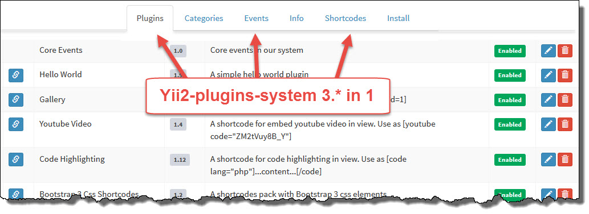

# Getting started with Yii2-plugins-system
[](https://packagist.org/packages/loveorigami/yii2-plugins-system) 
[](https://packagist.org/packages/loveorigami/yii2-plugins-system)
[](https://packagist.org/packages/loveorigami/yii2-plugins-system)

Yii2-plugins-system is designed to work out of the box. It means that installation requires
minimal steps. Only one configuration step should be taken and you are ready to
have plugin system on your Yii2 website.



### 1. Download

Yii2-plugins-system can be installed using composer. Run following command to download and
install Yii2-plugins-system:

```bash
composer require "loveorigami/yii2-plugins-system": ">=3.*"
```

### 2. Update database schema

The last thing you need to do is updating your database schema by applying the
migrations. Make sure that you have properly configured `db` application component,
add in our console config namespace migration - [more here](http://www.yiiframework.com/doc-2.0/guide-db-migrations.html#namespaced-migrations)

```php
return [
    'controllerMap' => [
        'migrate' => [
            'class' => 'yii\console\controllers\MigrateController',
            'migrationNamespaces' => [
                 ...
                'lo\plugins\migrations'
            ],
        ],
    ],
];
```

and run the following command:

```php
$ php yii migrate
```

### 3. Configure application

Let's start with defining module in `@backend/config/main.php`:

```php
'modules' => [
    'plugins' => [
        'class' => 'lo\plugins\Module',
        'pluginsDir'=>[
            '@lo/plugins/core', // default dir with core plugins
            // '@common/plugins', // dir with our plugins
        ]
    ],
],
```
That's all, now you have module installed and configured in advanced template.

Next, open `@frontend/config/main.php` and add following:

```php
...
'bootstrap' => ['log', 'plugins'],
...
'components' => [
    'plugins' => [
        'class' => lo\plugins\components\PluginsManager::class,
        'appId' => 1 // lo\plugins\BasePlugin::APP_FRONTEND,
        // by default
        'enablePlugins' => true,
        'shortcodesParse' => true,
        'shortcodesIgnoreBlocks' => [
            '<pre[^>]*>' => '<\/pre>',
            //'<div class="content[^>]*>' => '<\/div>',
        ]
    ],
    'view' => [
        'class' => lo\plugins\components\View::class,
    ]
    ...
]
```

Also do the same thing with 
* `@backend/config/main.php`
* `@console/config/main.php`
* `@api/config/main.php`
* our modules 
* etc...

```php
...
'bootstrap' => ['log', 'plugins'],
...
'components' => [
    'plugins' => [
        'class' => lo\plugins\components\PluginsManager::class,
        'appId' => 2 // lo\plugins\BasePlugin::APP_BACKEND or our appId
    ],
    'view' => [
        'class' => lo\plugins\components\View::class,
    ]
    ...
]
```

## Base AppId ```lo\plugins\BasePlugin::```
* const APP_FRONTEND = 1;
* const APP_BACKEND = 2;
* const APP_COMMON = 3;
* const APP_API = 4;
* const APP_CONSOLE = 5;

## Shortcodes
* [Yii2-shortcodes-pack](https://github.com/loveorigami/yii2-shortcodes-pack)

## Core plugins (examples)

* [External links](src/core/extralinks)
* [Http Authentication](src/core/httpauth)
* [Hello world!](src/core/helloworld)

## Your plugins

* [Create](docs/create_plugin.md)
* [Install](docs/install_plugin.md)

## Contributing to this project

Anyone and everyone is welcome to contribute. Please take a moment to
review the [guidelines for contributing](CONTRIBUTING.md).

## License

Yii2-plugins-system is released under the MIT License. See the bundled [LICENSE.md](LICENSE.md)
for details.
